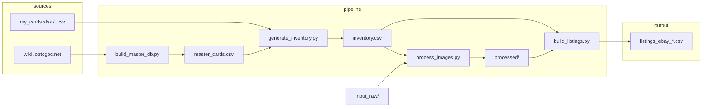

# Architecture

## Flux de données

1. **Base cartes** — `build_master_db.py` scrape le wiki → `data/master_cards.csv`.
2. **Inventaire** — Tu remplis `data/my_cards.xlsx` (ou `.csv`) ; `generate_inventory.py` fusionne avec le master → `data/inventory.csv` (SKU + champs enrichis).
3. **Photos** — Fichiers `input_raw/<SKU>_recto.jpg` et `_verso.jpg` ; `process_images.py` → `processed/` + `manifest.json`.
4. **Listings** — Optionnel : `upload_cdn.py` ou `upload_ebay.py` pour les URLs d’images ; `build_listings.py` lit l’inventaire + le template → CSV par marketplace.

## Format SKU

`LOTR-<Set>-<CardID>-<Foil>-<Cond>[-<Lang>]-<idx>`

| Partie | Exemple | Description |
|--------|--------|-------------|
| Set | `09` | Numéro de set sur 2 chiffres |
| CardID | `9R49` | Identifiant carte (set + rareté + numéro) |
| Foil | `F` / `NF` | Foil ou Non-foil |
| Cond | `NM` | Condition (NM, LP, MP, HP, D) |
| Lang | `FR` | Optionnel, omis si EN |
| idx | `01` | Numéro d’exemplaire (Quantity > 1) |

Exemple : `LOTR-09-9R49-F-NM-01` — carte Reflections 9R49, foil, Near Mint, exemplaire 1.

Les noms de fichiers photo doivent suivre : `<SKU>_recto.jpg`, `<SKU>_verso.jpg`.

## Rôles des répertoires

| Dossier / fichier | Rôle |
|-------------------|------|
| `config/settings.yaml` | Configuration centrale (crop, chemins, marketplaces, API) |
| `data/master_cards.csv` | Base des cartes (générée par le scraper) |
| `data/my_cards.xlsx` ou `.csv` | Ton inventaire saisi |
| `data/inventory.csv` | Inventaire complet généré (enrichi + SKU) |
| `input_raw/` | Photos brutes nommées par SKU |
| `processed/` | Images traitées, `manifest.json`, éventuellement `image_urls.json` |
| `templates/description.html` | Template Jinja2 des descriptions eBay |

## Contrats de fichiers

- **manifest.json** (dans `processed/`) : `{ "<SKU>": { "recto": "<path>", "verso": "<path>" } }`.
- **image_urls.json** / **image_urls_ebay.json** : `{ "<SKU>": { "recto": "<url>", "verso": "<url>" } }` pour `build_listings.py`.
- **inventory.csv** : colonnes définies par `generate_inventory.py` (FIELDNAMES) ; ne pas supprimer de colonnes utilisées par `build_listings.py` ou le template.
